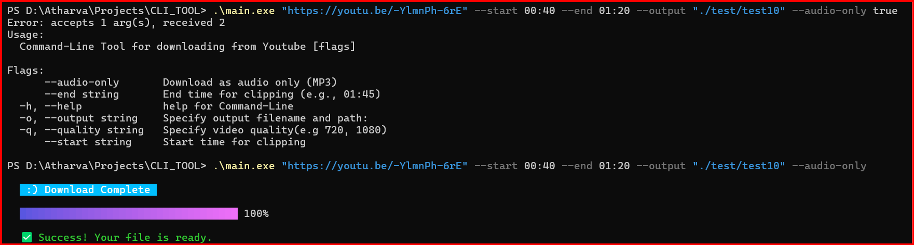

# Go YouTube Downloader CLI

-  A modern, graphical command-line tool built with Go to download YouTube videos and clips. This tool acts as a user-friendly frontend for the powerful yt-dlp engine, providing an interactive and polished experience directly in your terminal.
-  This project was built brick-by-brick, starting with a simple script and evolving into a feature-rich, visually appealing TUI (Text-based User Interface) application.

## **Features**
- **Interactive TUI**: A graphical interface that runs in your terminal, featuring a progress bar and status updates.

- **Quality Selection**: Choose a specific video resolution for your download.

- **Audio-Only Mode**: Easily extract audio from any video and save it as an MP3.

- **Video Clipping**: Download specific segments of a video by providing start and end timestamps.

- **Custom Output**: Specify the exact filename and path for your downloaded files.

- **Cross-Platform**: Compile and run on Windows, macOS, and Linux.

---
## **Usage**
- Once installed, you can run the tool from any location in your terminal. The recommended way is to run it without arguments to launch the full interactive TUI.
  
```
yt-downloader-cli-tool
```

#### You can also use flags for quick, non-interactive use.

- Specify Output Path (--output, -o)

```
yt-downloader-cli-tool <youtube_url> --output "my-videos/clip.mp4"
```
- Select Quality (--quality, -q)

```
yt-downloader-cli-tool <youtube_url> -q 720
```

- Download Audio Only (--audio-only)
```
yt-downloader-clli-tool <youtube_url> --audio-only
```

- Clip a Video (--start, --end)
```
yt-downloader-cli-tool <youtube_url> --start 01:30 --end 02:00
```
---
## **Prerequisites**
#### Before you can use this tool, you must have yt-dlp installed and accessible in your system's PATH. This tool is the core engine that handles the actual downloading.
---
## **Built With**
- **Go** - The core programming language.

- **Cobra** - For building a powerful command-line interface structure.

- **Bubble Tea** - For creating the interactive Text-based User Interface (TUI).

- **Lipgloss** - For styling the TUI with colors, borders, and layouts.

- **Bubbles** - A library of ready-to-use TUI components like spinners, progress bars, and lists.

---
## Future Updates
- **YouTube Shorts Support**: A dedicated option to easily download YouTube Shorts.

- **Enhanced Graphical TUI**: Further improvements to the visual design and interactivity of the terminal interface.

---

